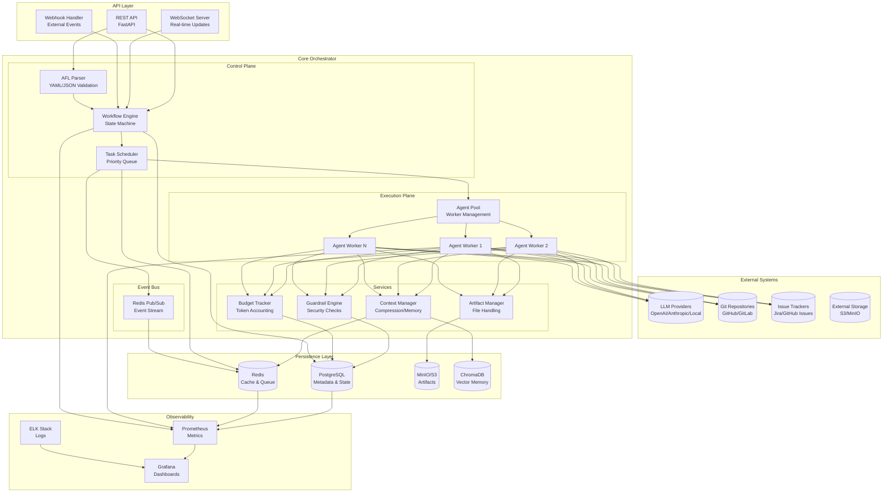
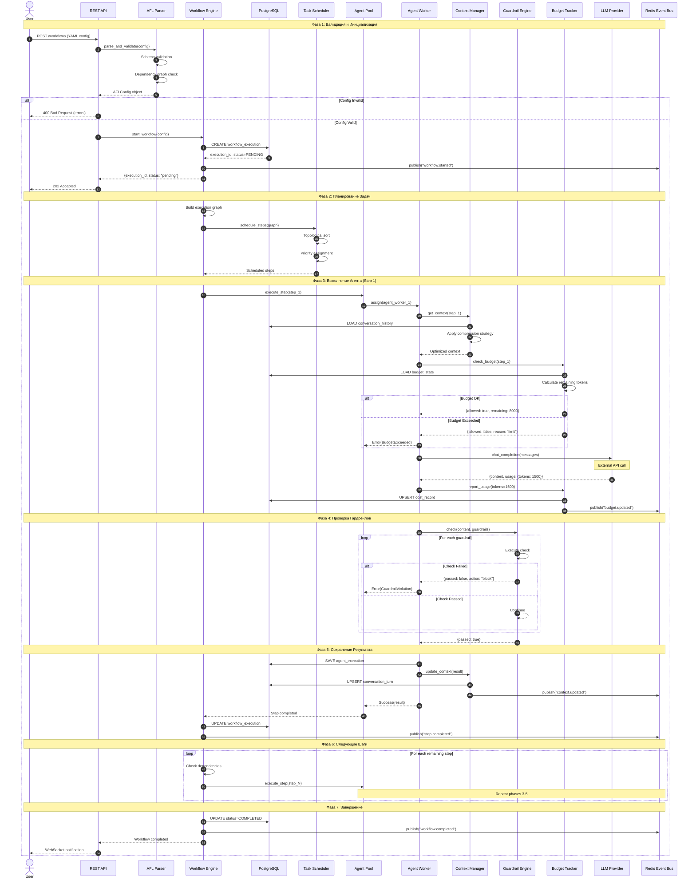
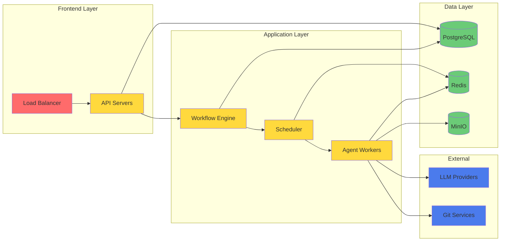
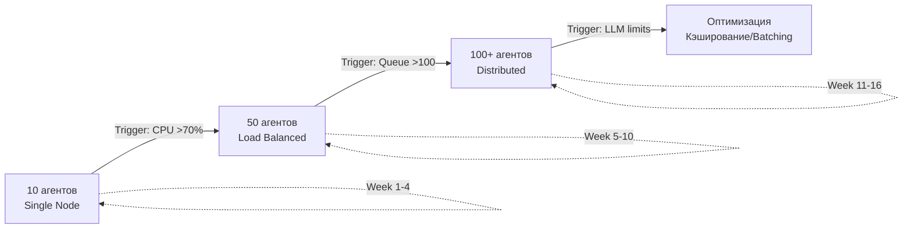

# AFL Orchestrator: Детальная Архитектура Системы

**Версия**: 1.0 **Дата**: 2026-03-31 **Статус**: Approved **Автор**: Senior
System Architect

---

## 1. Обзор Архитектуры

### 1.1 Архитектурный стиль

AFL Orchestrator использует **гибридную архитектуру**, сочетающую:

- **Event-Driven Architecture** для асинхронной коммуникации компонентов
- **Pipeline Pattern** для обработки workflow
- **Strategy Pattern** для вариативности алгоритмов (сжатие контекста,
  гардрейлы)
- **Actor Model** для изоляции выполнения агентов

### 1.2 Принципы проектирования

| Принцип                   | Реализация                             |
| ------------------------- | -------------------------------------- |
| **Single Responsibility** | Каждый компонент решает одну задачу    |
| **Loose Coupling**        | Компоненты общаются через шину событий |
| **High Cohesion**         | Связанные функции сгруппированы        |
| **Failure Isolation**     | Сбой агента не ломет весь workflow     |
| **Graceful Degradation**  | Fallback стратегии при ошибках         |

---

## 2. Компонентная Диаграмма



### 2.1 Описание компонентов

| Компонент            | Ответственность                | Технология              | Критичность |
| -------------------- | ------------------------------ | ----------------------- | ----------- |
| **REST API**         | Приём запросов, аутентификация | FastAPI                 | 🔴 High     |
| **WebSocket Server** | Real-time уведомления          | FastAPI WebSocket       | 🟡 Medium   |
| **AFL Parser**       | Валидация конфигов             | Pydantic + PyYAML       | 🔴 High     |
| **Workflow Engine**  | Управление состоянием          | State Machine           | 🔴 High     |
| **Task Scheduler**   | Планирование задач             | Celery + Redis          | 🔴 High     |
| **Agent Pool**       | Управление воркерами           | asyncio.TaskGroup       | 🔴 High     |
| **Context Manager**  | Сжатие и передача контекста    | Custom + ChromaDB       | 🟡 Medium   |
| **Guardrail Engine** | Проверки безопасности          | Chain of Responsibility | 🔴 High     |
| **Budget Tracker**   | Учёт токенов и затрат          | Event Sourcing          | 🟡 Medium   |
| **Artifact Manager** | Работа с файлами               | MinIO SDK               | 🟡 Medium   |
| **Event Bus**        | Асинхронная коммуникация       | Redis Pub/Sub           | 🔴 High     |

---

## 3. Последовательность Выполнения Workflow



### 3.1 Временные характеристики

| Фаза | Операция              | Ожидаемое время | P95     |
| ---- | --------------------- | --------------- | ------- |
| 1    | Валидация конфига     | <50 мс          | <100 мс |
| 1    | Создание записи в БД  | <10 мс          | <20 мс  |
| 2    | Построение графа      | <20 мс          | <50 мс  |
| 3    | Получение контекста   | <100 мс         | <200 мс |
| 3    | Проверка бюджета      | <10 мс          | <20 мс  |
| 3    | LLM вызов             | 2-15 сек        | <30 сек |
| 4    | Проверка гардрейлов   | <100 мс         | <200 мс |
| 5    | Сохранение результата | <20 мс          | <50 мс  |
| 7    | Финализация           | <10 мс          | <20 мс  |

---

## 4. Обоснование Архитектурных Решений

### 4.1 Выбор паттернов проектирования

| Паттерн                     | Где используется    | Почему выбран                                   | Альтернативы             |
| --------------------------- | ------------------- | ----------------------------------------------- | ------------------------ |
| **State Machine**           | Workflow Engine     | Явные состояния, лёгкая отладка, восстановление | Spaghetti code с if/else |
| **Event-Driven**            | Event Bus           | Слабая связанность, масштабируемость            | Прямые вызовы методов    |
| **Strategy**                | Context Compression | Динамическая смена алгоритмов                   | Hardcoded логика         |
| **Chain of Responsibility** | Guardrail Engine    | Композиция проверок, ранний выход               | Последовательные if/else |
| **Repository**              | Data Access         | Абстракция БД, тестируемость                    | Прямые SQL запросы       |
| **Factory**                 | Agent/Tool Creation | Инкапсуляция создания                           | Прямые конструкторы      |
| **Circuit Breaker**         | LLM Integration     | Защита от cascade failures                      | Простые retry            |
| **Event Sourcing**          | Budget Tracker      | Аудит, воспроизводимость                        | CRUD подход              |

### 4.2 Выбор технологий

#### 4.2.1 Асинхронность: asyncio vs Celery

| Критерий           | asyncio    | Celery     | Выбор                   |
| ------------------ | ---------- | ---------- | ----------------------- |
| Производительность | ⭐⭐⭐⭐⭐ | ⭐⭐⭐     | **asyncio** для I/O     |
| Сложность          | ⭐⭐⭐     | ⭐⭐⭐⭐   | asyncio проще           |
| Распределённость   | ❌         | ✅         | **Celery** для воркеров |
| Retry логика       | Ручная     | Встроенная | **Celery**              |
| Мониторинг         | Сложнее    | Flower UI  | **Celery**              |

**Решение**: Гибридный подход

- **asyncio**: Внутри агента (LLM calls, context management)
- **Celery**: Между агентами (task queue, retry, distribution)

#### 4.2.2 База данных: PostgreSQL vs MongoDB

| Критерий        | PostgreSQL  | MongoDB        | Выбор                     |
| --------------- | ----------- | -------------- | ------------------------- |
| Транзакции      | ✅ ACID     | ⚠️ Limited     | **PostgreSQL**            |
| JSON поддержка  | ✅ JSONB    | ✅ Native      | Tie                       |
| Сложные запросы | ✅ SQL      | ⚠️ Aggregation | **PostgreSQL**            |
| Миграции        | ✅ Alembic  | ⚠️ Ручные      | **PostgreSQL**            |
| Векторный поиск | ⚠️ pgvector | ❌             | **PostgreSQL + ChromaDB** |

**Решение**: PostgreSQL для метаданных + ChromaDB для векторной памяти

#### 4.2.3 Event Bus: Redis Pub/Sub vs Kafka vs RabbitMQ

| Критерий               | Redis          | Kafka    | RabbitMQ  | Выбор     |
| ---------------------- | -------------- | -------- | --------- | --------- |
| Задержка               | <1 мс          | ~10 мс   | ~5 мс     | **Redis** |
| Пропускная способность | 100K/msg/s     | 1M/msg/s | 50K/msg/s | Kafka     |
| Персистентность        | ⚠️ Опционально | ✅       | ✅        | Kafka     |
| Сложность              | ⭐             | ⭐⭐⭐   | ⭐⭐      | **Redis** |
| Для MVP                | ✅             | Overkill | ✅        | **Redis** |

**Решение**: Redis Pub/Sub для MVP, миграция на Kafka при 1000+ workflow/день

### 4.3 Структура проекта

```
afl-orchestrator/
├── src/
│   ├── orchestrator/
│   │   ├── __init__.py
│   │   ├── main.py                 # FastAPI app entry point
│   │   ├── config.py               # Settings management
│   │   │
│   │   ├── api/                    # API Layer
│   │   │   ├── __init__.py
│   │   │   ├── routes/
│   │   │   │   ├── workflows.py
│   │   │   │   ├── agents.py
│   │   │   │   └── metrics.py
│   │   │   ├── websockets.py
│   │   │   └── webhooks.py
│   │   │
│   │   ├── parser/                 # Parser Module
│   │   │   ├── __init__.py
│   │   │   ├── afl_parser.py
│   │   │   ├── schema.py           # Pydantic models
│   │   │   └── validators.py
│   │   │
│   │   ├── engine/                 # Workflow Engine
│   │   │   ├── __init__.py
│   │   │   ├── workflow_engine.py
│   │   │   ├── state_machine.py
│   │   │   └── graph_executor.py
│   │   │
│   │   ├── scheduler/              # Task Scheduler
│   │   │   ├── __init__.py
│   │   │   ├── celery_app.py
│   │   │   └── tasks.py
│   │   │
│   │   ├── agent/                  # Agent Execution Plane
│   │   │   ├── __init__.py
│   │   │   ├── pool.py
│   │   │   ├── worker.py
│   │   │   ├── base.py             # IAgent interface
│   │   │   └── types/
│   │   │       ├── llm_agent.py
│   │   │       └── tool_agent.py
│   │   │
│   │   ├── services/               # Business Logic
│   │   │   ├── __init__.py
│   │   │   ├── context_manager.py
│   │   │   ├── guardrail_engine.py
│   │   │   ├── budget_tracker.py
│   │   │   └── artifact_manager.py
│   │   │
│   │   ├── integrations/           # External Systems
│   │   │   ├── __init__.py
│   │   │   ├── llm/
│   │   │   │   ├── base.py
│   │   │   │   ├── openai.py
│   │   │   │   └── anthropic.py
│   │   │   ├── git/
│   │   │   │   └── git_manager.py
│   │   │   └── trackers/
│   │   │       ├── jira.py
│   │   │       └── github.py
│   │   │
│   │   ├── storage/                # Persistence Layer
│   │   │   ├── __init__.py
│   │   │   ├── database.py
│   │   │   ├── models/
│   │   │   │   ├── workflow.py
│   │   │   │   ├── agent.py
│   │   │   │   └── budget.py
│   │   │   ├── repositories/
│   │   │   │   ├── workflow_repo.py
│   │   │   │   └── agent_repo.py
│   │   │   └── migrations/
│   │   │
│   │   ├── events/                 # Event Bus
│   │   │   ├── __init__.py
│   │   │   ├── bus.py
│   │   │   └── events.py
│   │   │
│   │   └── observability/          # Monitoring
│   │       ├── __init__.py
│   │       ├── metrics.py
│   │       ├── logging.py
│   │       └── tracing.py
│   │
│   └── tools/                      # Available Tools
│       ├── __init__.py
│       ├── base.py
│       ├── http_tool.py
│       ├── file_tool.py
│       └── shell_tool.py
│
├── tests/
│   ├── unit/
│   ├── integration/
│   └── e2e/
│
├── deployments/
│   ├── docker/
│   ├── kubernetes/
│   └── docker-compose.yml
│
└── docs/
    ├── api.md
    ├── afl-spec.md
    └── architecture.md
```

---

## 5. Точки Отказа и Восстановление

### 5.1 Карта точек отказа



### 5.2 Анализ точек отказа

| Компонент           | Тип отказа                | Вероятность | Влияние     | Стратегия восстановления                  |
| ------------------- | ------------------------- | ----------- | ----------- | ----------------------------------------- |
| **Load Balancer**   | Полный отказ              | Низкая      | Критическое | DNS failover, health checks               |
| **API Server**      | Crash одного инстанса     | Средняя     | Высокое     | Auto-restart, multiple replicas           |
| **Workflow Engine** | Потеря состояния          | Низкая      | Критическое | State persistence в БД после каждого шага |
| **Scheduler**       | Зависание очереди         | Средняя     | Высокое     | Redis persistence, retry queue            |
| **Agent Worker**    | Crash во время выполнения | Высокая     | Среднее     | Task retry, checkpoint context            |
| **PostgreSQL**      | Connection pool exhausted | Средняя     | Высокое     | Connection pooling, read replicas         |
| **PostgreSQL**      | Disk full                 | Низкая      | Критическое | Monitoring, auto-scaling storage          |
| **Redis**           | Memory limit reached      | Средняя     | Высокое     | LRU eviction, cluster mode                |
| **MinIO**           | Storage failure           | Низкая      | Высокое     | Replication, S3 fallback                  |
| **LLM Provider**    | Rate limiting             | Высокая     | Высокое     | Circuit breaker, fallback models          |
| **LLM Provider**    | Timeout                   | Высокая     | Среднее     | Retry with backoff, async queue           |
| **LLM Provider**    | API change                | Низкая      | Высокое     | Abstraction layer, versioning             |
| **Network**         | Partition                 | Низкая      | Критическое | Retry, eventual consistency               |

### 5.3 Стратегии восстановления

#### 5.3.1 Workflow Recovery

```python
class WorkflowRecoveryStrategy:
    """Стратегия восстановления workflow после сбоя"""

    async def recover_workflow(self, execution_id: str) -> RecoveryResult:
        # 1. Загрузка последнего сохранённого состояния
        state = await self.storage.load_workflow_state(execution_id)

        # 2. Определение точки восстановления
        last_completed_step = state.get("last_completed_step")
        current_step = state.get("current_step")

        # 3. Проверка идемпотентности
        if await self.is_step_idempotent(current_step):
            # Можно безопасно повторить
            return RecoveryAction.RETRY
        else:
            # Нужен rollback к последнему completed
            return RecoveryAction.ROLLBACK_TO(last_completed_step)

    async def is_step_idempotent(self, step: str) -> bool:
        # Шаги без side effects идемпотентны
        non_idempotent_steps = {"commit_and_push", "create_issue", "send_notification"}
        return step not in non_idempotent_steps
```

#### 5.3.2 Agent Worker Recovery

```python
class AgentWorkerRecovery:
    """Восстановление после сбоя агента"""

    def __init__(self):
        self.max_retries = 3
        self.base_delay = 1.0  # seconds

    async def execute_with_recovery(
        self,
        agent_id: str,
        context: Dict[str, Any],
        step_id: str
    ) -> AgentResult:
        for attempt in range(self.max_retries):
            try:
                # Checkpoint перед выполнением
                await self.checkpoint(step_id, context, attempt)

                result = await self.agent.execute(agent_id, context)

                # Ack успешного выполнения
                await self.ack(step_id)
                return result

            except TransientError as e:
                # Временная ошибка - retry
                delay = self.base_delay * (2 ** attempt)  # Exponential backoff
                await asyncio.sleep(delay)

            except PermanentError as e:
                # Постоянная ошибка - не retry
                await self.handle_permanent_error(step_id, e)
                raise

        # Все retry исчерпаны
        await self.handle_exhausted_retries(step_id)
        raise MaxRetriesExceeded()

    async def checkpoint(self, step_id: str, context: Dict, attempt: int):
        # Сохранение контекста для восстановления
        await self.redis.setex(
            f"checkpoint:{step_id}",
            ttl=3600,
            value=json.dumps({"context": context, "attempt": attempt})
        )
```

#### 5.3.3 Circuit Breaker для LLM

```python
from circuitbreaker import circuit

class LLMIntegration:
    @circuit(
        failure_threshold=5,      # 5 ошибок
        recovery_timeout=120,     # 2 минуты до retry
        expected_exception=LLMError
    )
    async def chat_completion(self, messages: List[Dict]) -> LLMResponse:
        try:
            return await self._call_llm(messages)
        except TimeoutError:
            raise LLMError("Timeout")
        except RateLimitError:
            raise LLMError("Rate limited")

    async def _call_llm(self, messages: List[Dict]) -> LLMResponse:
        # Реальный вызов LLM
        pass
```

### 5.4 Матрица RTO/RPO

| Компонент       | RTO (Recovery Time) | RPO (Recovery Point) | Стратегия          |
| --------------- | ------------------- | -------------------- | ------------------ |
| API Server      | <1 мин              | 0 (stateless)        | Auto-restart       |
| Workflow Engine | <5 мин              | <1 шаг               | State persistence  |
| Agent Worker    | <2 мин              | <1 задача            | Task retry         |
| PostgreSQL      | <10 мин             | 0 (sync replication) | Failover к replica |
| Redis           | <5 мин              | <1 мин (AOF)         | Redis Sentinel     |
| MinIO           | <15 мин             | 0 (erasure coding)   | Replication        |

---

## 6. Масштабирование: от 10 до 100 Агентов

### 6.1 Уровни масштабирования

```mermaid
graph TB
    subgraph "Level 1: 10 агентов (MVP)"
        L1_API[1 API Instance]
        L1_ENGINE[1 Engine Instance]
        L1_WORKERS[3 Agent Workers]
        L1_DB[(1 PostgreSQL)]
        L1_REDIS[(1 Redis)]

        L1_API --> L1_ENGINE
        L1_ENGINE --> L1_WORKERS
        L1_WORKERS --> L1_DB
        L1_WORKERS --> L1_REDIS
    end

    subgraph "Level 2: 50 агентов (Alpha)"
        L2_LB[Load Balancer]
        L2_API[2 API Instances]
        L2_ENGINE[2 Engine Instances]
        L2_WORKERS[10 Agent Workers]
        L2_DB[(PostgreSQL Primary<br/>+ Read Replica)]
        L2_REDIS[(Redis Sentinel<br/>3 nodes)]

        L2_LB --> L2_API
        L2_API --> L2_ENGINE
        L2_ENGINE --> L2_WORKERS
        L2_WORKERS --> L2_DB
        L2_WORKERS --> L2_REDIS
    end

    subgraph "Level 3: 100+ агентов (Production)"
        L3_LB[Load Balancer]
        L3_API[4+ API Instances]
        L3_ENGINE[4+ Engine Instances]
        L3_SCHED[Celery Cluster]
        L3_WORKERS[20+ Agent Workers]
        L3_DB[(PostgreSQL Cluster<br/>1 Primary + 3 Replicas)]
        L3_REDIS[(Redis Cluster<br/>6 nodes)]
        L3_KAFKA[Kafka Cluster]
        L3_MINIO[MinIO Cluster]

        L3_LB --> L3_API
        L3_API --> L3_ENGINE
        L3_ENGINE --> L3_SCHED
        L3_SCHED --> L3_WORKERS
        L3_WORKERS --> L3_DB
        L3_WORKERS --> L3_REDIS
        L3_WORKERS --> L3_KAFKA
        L3_WORKERS --> L3_MINIO
    end
```



### 6.2 Стратегии масштабирования по компонентам

#### 6.2.1 API Layer: Horizontal Scaling

| Метрика       | 10 агентов | 50 агентов  | 100 агентов |
| ------------- | ---------- | ----------- | ----------- |
| Инстансы API  | 1          | 2-3         | 4-6         |
| Requests/sec  | ~50        | ~250        | ~500        |
| Load Balancer | —          | nginx       | nginx/ALB   |
| Rate Limiting | Local      | Redis-based | Redis-based |

```yaml
# Kubernetes HPA для API
apiVersion: autoscaling/v2
kind: HorizontalPodAutoscaler
metadata:
  name: api-hpa
spec:
  scaleTargetRef:
    apiVersion: apps/v1
    kind: Deployment
    name: afl-api
  minReplicas: 2
  maxReplicas: 10
  metrics:
    - type: Resource
      resource:
        name: cpu
        target:
          type: Utilization
          averageUtilization: 70
    - type: Resource
      resource:
        name: memory
        target:
          type: Utilization
          averageUtilization: 80
```

#### 6.2.2 Agent Workers: Pool Scaling

| Метрика               | 10 агентов | 50 агентов  | 100 агентов    |
| --------------------- | ---------- | ----------- | -------------- |
| Worker пул            | 3 воркера  | 10 воркеров | 20-30 воркеров |
| Concurrency на воркер | 3          | 5           | 5              |
| Queue                 | Redis list | Celery      | Celery + Kafka |
| Auto-scaling          | —          | KEDA        | KEDA           |

```python
# Dynamic worker scaling based on queue depth
class AgentPoolScaler:
    def __init__(self, min_workers=3, max_workers=30):
        self.min_workers = min_workers
        self.max_workers = max_workers

    async def scale_workers(self):
        queue_depth = await self.redis.llen("task_queue")
        active_workers = await self.get_active_worker_count()

        # 1 воркер на 5 задач в очереди
        target_workers = min(
            self.max_workers,
            max(self.min_workers, queue_depth // 5)
        )

        if target_workers > active_workers:
            await self.spawn_workers(target_workers - active_workers)
        elif target_workers < active_workers:
            await self.terminate_workers(active_workers - target_workers)
```

#### 6.2.3 Database: Read/Write Scaling

| Метрика         | 10 агентов | 50 агентов            | 100 агентов            |
| --------------- | ---------- | --------------------- | ---------------------- |
| PostgreSQL      | 1 инстанс  | 1 Primary + 1 Replica | 1 Primary + 3 Replicas |
| Connection Pool | 20 conn    | 50 conn               | 100 conn               |
| Write traffic   | Direct     | Direct                | Direct                 |
| Read traffic    | Direct     | Split (80/20)         | Split (60/40)          |

```python
# Read/Write splitting
class DatabaseRouter:
    def __init__(self):
        self.primary = get_database("primary")
        self.replicas = [
            get_database("replica-1"),
            get_database("replica-2"),
            get_database("replica-3"),
        ]
        self.replica_index = 0

    def get_connection(self, read_only: bool = False):
        if not read_only:
            return self.primary

        # Round-robin для read запросов
        replica = self.replicas[self.replica_index % len(self.replicas)]
        self.replica_index += 1
        return replica
```

#### 6.2.4 Redis: Cluster Mode

| Метрика     | 10 агентов | 50 агентов               | 100 агентов              |
| ----------- | ---------- | ------------------------ | ------------------------ |
| Режим       | Standalone | Sentinel                 | Cluster                  |
| Ноды        | 1          | 3 (1 master + 2 replica) | 6 (3 master + 3 replica) |
| Memory      | 4 GB       | 8 GB                     | 16 GB                    |
| Persistence | RDB        | RDB + AOF                | RDB + AOF                |

```python
# Redis Cluster configuration
from redis.cluster import RedisCluster

class RedisClusterManager:
    def __init__(self):
        self.client = RedisCluster(
            startup_nodes=[
                {"host": "redis-node-1", "port": 7000},
                {"host": "redis-node-2", "port": 7000},
                {"host": "redis-node-3", "port": 7000},
            ],
            decode_responses=True,
        )

    async def get_cache(self, key: str) -> Optional[str]:
        # Cluster автоматически роутит к правильной ноде
        return self.client.get(f"cache:{key}")
```

#### 6.2.5 Event Bus: Redis → Kafka Migration

| Метрика         | 10-50 агентов     | 100+ агентов |
| --------------- | ----------------- | ------------ |
| Event Bus       | Redis Pub/Sub     | Kafka        |
| Throughput      | 100K msg/s        | 1M+ msg/s    |
| Retention       | 0 (fire & forget) | 7 дней       |
| Consumer groups | —                 | ✅ Поддержка |

```python
# Abstract event bus with provider switching
class EventBus(ABC):
    @abstractmethod
    async def publish(self, topic: str, message: Dict):
        pass

    @abstractmethod
    async def subscribe(self, topic: str, handler: Callable):
        pass

class RedisEventBus(EventBus):
    async def publish(self, topic: str, message: Dict):
        await self.redis.publish(topic, json.dumps(message))

class KafkaEventBus(EventBus):
    async def publish(self, topic: str, message: Dict):
        await self.producer.send_and_wait(topic, json.dumps(message).encode())
```

### 6.3 Bottleneck Analysis

| Компонент | Bottleneck при 10 | Bottleneck при 50    | Bottleneck при 100   |
| --------- | ----------------- | -------------------- | -------------------- |
| API       | CPU               | Network I/O          | Database connections |
| Engine    | —                 | Memory (state cache) | Event bus throughput |
| Workers   | LLM latency       | LLM rate limits      | LLM rate limits      |
| Database  | —                 | Write throughput     | Connection pool      |
| Redis     | Memory            | Network              | Cluster coordination |
| LLM       | —                 | Rate limits          | Rate limits          |

### 6.4 План масштабирования



| Триггер             | Действие               | Сложность |
| ------------------- | ---------------------- | --------- |
| CPU API >70% 5 мин  | Добавить API реплику   | 🟢 Low    |
| Queue depth >100    | Добавить agent workers | 🟢 Low    |
| DB connections >80% | Добавить read replica  | 🟡 Medium |
| Redis memory >80%   | Миграция на cluster    | 🟡 Medium |
| LLM rate limit      | Implement batching     | 🟡 Medium |
| Event loss >0.1%    | Миграция на Kafka      | 🔴 High   |

---

## 7. Примеры Кода

### 7.1 Workflow Engine: State Machine

```python
from enum import Enum, auto
from typing import Dict, Optional, Callable
from dataclasses import dataclass
from datetime import datetime

class WorkflowState(Enum):
    PENDING = auto()
    RUNNING = auto()
    PAUSED = auto()
    COMPLETED = auto()
    FAILED = auto()
    CANCELLED = auto()

@dataclass
class StateTransition:
    from_state: WorkflowState
    to_state: WorkflowState
    condition: Optional[Callable] = None

class WorkflowStateMachine:
    """Машина состояний для workflow"""

    # Определение допустимых переходов
    TRANSITIONS = [
        StateTransition(WorkflowState.PENDING, WorkflowState.RUNNING),
        StateTransition(WorkflowState.RUNNING, WorkflowState.PAUSED),
        StateTransition(WorkflowState.PAUSED, WorkflowState.RUNNING),
        StateTransition(WorkflowState.RUNNING, WorkflowState.COMPLETED,
                       lambda ctx: ctx.all_steps_completed),
        StateTransition(WorkflowState.RUNNING, WorkflowState.FAILED),
        StateTransition(WorkflowState.RUNNING, WorkflowState.CANCELLED),
        StateTransition(WorkflowState.PAUSED, WorkflowState.CANCELLED),
        StateTransition(WorkflowState.FAILED, WorkflowState.RUNNING,
                       lambda ctx: ctx.retry_allowed),
    ]

    def __init__(self, execution_id: str, storage: Storage):
        self.execution_id = execution_id
        self.storage = storage
        self.current_state = WorkflowState.PENDING

    async def transition_to(
        self,
        target_state: WorkflowState,
        context: Optional[Dict] = None
    ) -> bool:
        """Выполнить переход состояния"""

        # Поиск допустимого перехода
        transition = self._find_transition(self.current_state, target_state)

        if not transition:
            raise InvalidStateTransition(
                f"Cannot transition from {self.current_state} to {target_state}"
            )

        # Проверка условия перехода
        if transition.condition and not transition.condition(context):
            raise TransitionConditionFailed(
                f"Transition condition not met for {target_state}"
            )

        # Сохранение текущего состояния для rollback
        previous_state = self.current_state

        try:
            # Выполнение перехода
            self.current_state = target_state

            # Персистентность в БД
            await self.storage.save_workflow_state(
                execution_id=self.execution_id,
                state=target_state.name,
                context=context,
                timestamp=datetime.utcnow()
            )

            # Публикация события
            await self.event_bus.publish(
                "workflow.state_changed",
                {
                    "execution_id": self.execution_id,
                    "from_state": previous_state.name,
                    "to_state": target_state.name,
                    "timestamp": datetime.utcnow().isoformat()
                }
            )

            return True

        except Exception as e:
            # Rollback при ошибке
            self.current_state = previous_state
            raise WorkflowStateError(f"Failed to transition: {e}")

    def _find_transition(
        self,
        from_state: WorkflowState,
        to_state: WorkflowState
    ) -> Optional[StateTransition]:
        for t in self.TRANSITIONS:
            if t.from_state == from_state and t.to_state == to_state:
                return t
        return None
```

### 7.2 Context Manager: Compression Strategy

```python
from abc import ABC, abstractmethod
from typing import List, Dict, Any

class CompressionStrategy(ABC):
    @abstractmethod
    async def compress(
        self,
        messages: List[Dict[str, str]],
        max_tokens: int
    ) -> List[Dict[str, str]]:
        pass

class SlidingWindowStrategy(CompressionStrategy):
    """Сохраняет только последние N сообщений"""

    def __init__(self, window_size: int = 20):
        self.window_size = window_size

    async def compress(
        self,
        messages: List[Dict[str, str]],
        max_tokens: int
    ) -> List[Dict[str, str]]:
        # System message всегда сохраняется
        system = [m for m in messages if m["role"] == "system"]
        other = [m for m in messages if m["role"] != "system"]

        # Берём последние window_size сообщений
        recent = other[-self.window_size:]

        return system + recent

class SummarizationStrategy(CompressionStrategy):
    """LLM-суммаризация старых сообщений"""

    def __init__(self, llm: LLMProvider, summary_ratio: float = 0.3):
        self.llm = llm
        self.summary_ratio = summary_ratio

    async def compress(
        self,
        messages: List[Dict[str, str]],
        max_tokens: int
    ) -> List[Dict[str, str]]:
        system = [m for m in messages if m["role"] == "system"]
        other = [m for m in messages if m["role"] != "system"]

        # Разделение на старую и новую часть
        split_idx = int(len(other) * self.summary_ratio)
        old_messages = other[:split_idx]
        recent_messages = other[split_idx:]

        # Суммаризация старой части
        if old_messages:
            summary = await self._summarize(old_messages)
            summary_message = {
                "role": "system",
                "content": f"Summary of previous conversation:\n{summary}"
            }
        else:
            summary_message = None

        result = system
        if summary_message:
            result.append(summary_message)
        result.extend(recent_messages)

        return result

    async def _summarize(self, messages: List[Dict]) -> str:
        conversation_text = "\n".join(
            f"{m['role']}: {m['content']}" for m in messages
        )

        prompt = f"""Summarize the following conversation in 3-5 sentences.
Focus on key decisions, facts, and action items.

{conversation_text}

Summary:"""

        response = await self.llm.chat_completion(
            messages=[{"role": "user", "content": prompt}],
            model="gpt-3.5-turbo",
            max_tokens=200
        )

        return response.content

class ContextManager:
    """Управление контекстом с выбором стратегии"""

    def __init__(self, storage: Storage, llm: LLMProvider):
        self.storage = storage
        self.strategies: Dict[str, CompressionStrategy] = {
            "sliding_window": SlidingWindowStrategy(window_size=20),
            "summarization": SummarizationStrategy(llm),
        }

    async def get_context(
        self,
        execution_id: str,
        step_id: str,
        strategy: str = "sliding_window",
        max_tokens: int = 4000
    ) -> List[Dict[str, str]]:
        # Загрузка истории из БД
        history = await self.storage.load_conversation_history(execution_id)

        # Выбор стратегии
        compressor = self.strategies.get(strategy)
        if not compressor:
            raise ValueError(f"Unknown compression strategy: {strategy}")

        # Сжатие
        compressed = await compressor.compress(history, max_tokens)

        # Подсчёт токенов
        token_count = await self._count_tokens(compressed)

        # Логирование метрик
        await self.metrics.record(
            "context_compression_ratio",
            original=len(history),
            compressed=len(compressed),
            tokens=token_count
        )

        return compressed
```

### 7.3 Guardrail Engine: Chain of Responsibility

```python
from typing import List, Optional, Tuple
from enum import Enum

class GuardrailResult(Enum):
    PASS = "pass"
    FAIL = "fail"
    MODIFY = "modify"

class GuardrailChain:
    """Цепочка гардрейлов"""

    def __init__(self):
        self.guardrails: List[BaseGuardrail] = []

    def add_guardrail(self, guardrail: BaseGuardrail):
        self.guardrails.append(guardrail)

    async def execute(
        self,
        content: str,
        context: Dict[str, Any]
    ) -> Tuple[bool, str, Dict]:
        """
        Выполнить цепочку проверок.
        Returns: (passed, final_content, metadata)
        """
        current_content = content
        all_metadata = {}

        for guardrail in self.guardrails:
            result = await guardrail.check(current_content, context)

            all_metadata[guardrail.id] = {
                "passed": result.passed,
                "message": result.message,
            }

            if not result.passed:
                # Ранний выход при блокировке
                if result.action == GuardrailAction.BLOCK:
                    return False, current_content, {
                        "failed_guardrail": guardrail.id,
                        "reason": result.message,
                        "all_results": all_metadata
                    }

                # Модификация контента
                elif result.action == GuardrailAction.MODIFY:
                    if result.modified_content:
                        current_content = result.modified_content
                        all_metadata[guardrail.id]["modified"] = True

            # Флагирование (продолжаем выполнение)
            elif result.action == GuardrailAction.FLAG:
                all_metadata[guardrail.id]["flagged"] = True

        # Все проверки пройдены
        return True, current_content, {
            "all_results": all_metadata,
            "guardrails_passed": len(self.guardrails)
        }

# Пример использования
async def setup_guardrail_chain(config: Dict) -> GuardrailChain:
    chain = GuardrailChain()

    # Добавление гардрейлов в порядке приоритета
    chain.add_guardrail(
        FileExtensionGuardrail(
            guardrail_id="block_executables",
            config={"blocked_extensions": [".exe", ".bat", ".sh"]}
        )
    )

    chain.add_guardrail(
        TokenLimitGuardrail(
            guardrail_id="step_budget",
            config={"max_tokens": 5000, "warning_threshold": 0.8}
        )
    )

    chain.add_guardrail(
        LLMJudgeGuardrail(
            guardrail_id="quality_check",
            config={
                "validation_prompt": "Оцени качество вывода",
                "threshold": 0.7,
                "model": "gpt-4"
            }
        )
    )

    return chain
```

---

## 8. Чеклист Архитектурной Готовности

### 8.1 MVP Ready (Недели 1-6)

- [ ] Parser Module: валидация YAML/JSON
- [ ] Workflow Engine: state machine с 7 состояниями
- [ ] Agent Executor: базовый LLM-агент
- [ ] Budget Tracker: учёт токенов
- [ ] Guardrail Engine: regex проверки
- [ ] Storage: PostgreSQL + Redis
- [ ] REST API: CRUD для workflow
- [ ] Observability: базовое логирование

### 8.2 Alpha Ready (Недели 7-10)

- [ ] Context Manager: сжатие контекста
- [ ] Guardrail Engine: LLM-as-a-Judge
- [ ] Git Integration: clone, read, diff
- [ ] Issue Tracker: Jira, GitHub
- [ ] Agent Pool: dynamic scaling
- [ ] Database: read replicas
- [ ] Monitoring: Prometheus + Grafana

### 8.3 Production Ready (Недели 11-16)

- [ ] High Availability: multi-instance
- [ ] Disaster Recovery: backup/restore
- [ ] Security: sandbox, encryption
- [ ] Performance: 100+ параллельных workflow
- [ ] Documentation: API, deployment, user guide
- [ ] SLA: 99.5% availability

---

## 9. Глоссарий

| Термин        | Определение                             |
| ------------- | --------------------------------------- |
| **Workflow**  | Последовательность шагов выполнения     |
| **Step**      | Отдельный этап workflow                 |
| **Agent**     | Исполнитель шага (LLM-based)            |
| **Context**   | Информация, передаваемая между агентами |
| **Guardrail** | Правило проверки безопасности/качества  |
| **Artifact**  | Файл/ресурс, создаваемый в workflow     |
| **Execution** | Конкретный запуск workflow              |
| **Token**     | Единица измерения LLM ввода/вывода      |

---

_Документ утверждён для реализации MVP_
