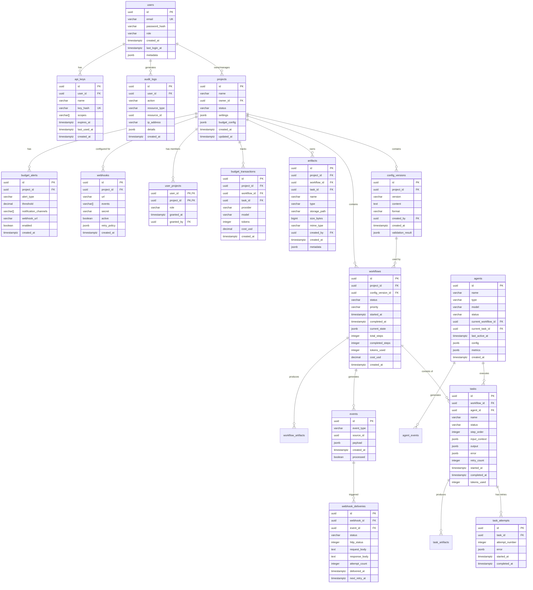

# AFL Orchestrator: Схема Базы Данных (Часть 1)

**Версия**: 1.0 **Дата**: 2026-03-31 **Статус**: Approved for Development
**Автор**: Senior DB Engineer & Data Architect

---

## 1. Концептуальная Модель Данных

### 1.1 ER-Диаграмма



### 1.2 Описание Сущностей

| Сущность                | Назначение                      | Объём (rows) | Read/Write | Критичность  |
| ----------------------- | ------------------------------- | ------------ | ---------- | ------------ |
| **users**               | Аутентификация и авторизация    | 1K-10K       | 90/10      | 🔴 Critical  |
| **projects**            | Контейнер для workflow          | 100-1K       | 70/30      | 🔴 Critical  |
| **config_versions**     | Версии AFL конфигов             | 1K-10K       | 80/20      | 🟡 Important |
| **workflows**           | Запуски workflow                | 100K-1M/год  | 60/40      | 🔴 Critical  |
| **tasks**               | Задачи внутри workflow          | 1M-10M/год   | 50/50      | 🔴 Critical  |
| **agents**              | Регистрация агентов             | 10-100       | 80/20      | 🟡 Important |
| **artifacts**           | Метаданные артефактов           | 500K-5M/год  | 70/30      | 🟡 Important |
| **events**              | События системы                 | 10M-100M/год | 90/10      | 🟢 Archive   |
| **audit_logs**          | Аудит действий                  | 1M-10M/год   | 95/5       | 🟡 Important |
| **budget_transactions** | Учёт токенов/затрат             | 5M-50M/год   | 80/20      | 🔴 Critical  |
| **api_keys**            | API ключи пользователей         | 1K-10K       | 95/5       | 🟡 Important |
| **user_projects**       | Связь пользователей с проектами | 1K-10K       | 80/20      | 🟡 Important |
| **webhooks**            | Настройки webhook               | 100-1K       | 90/10      | 🟢 Archive   |
| **webhook_deliveries**  | История доставок webhook        | 1M-10M/год   | 90/10      | 🟢 Archive   |
| **budget_alerts**       | Алерты бюджета                  | 100-1K       | 80/20      | 🟡 Important |
| **task_attempts**       | Попытки выполнения задач        | 5M-50M/год   | 90/10      | 🟢 Archive   |

### 1.3 MVP Приоритет

**Critical (MVP Week 1-2):**

- users
- projects
- config_versions
- workflows
- tasks
- agents
- budget_transactions

**Important (MVP Week 3-4):**

- artifacts
- audit_logs
- api_keys
- user_projects
- budget_alerts

**Post-MVP (Alpha/Beta):**

- events
- webhooks
- webhook_deliveries
- task_attempts

---

## 2. Физическая Схема Таблиц

### 2.1 Таблица: users

```sql
-- Таблица пользователей системы
CREATE TABLE users (
    -- Primary Key
    id UUID PRIMARY KEY DEFAULT gen_random_uuid(),

    -- Аутентификация
    email VARCHAR(255) NOT NULL,
    password_hash VARCHAR(255),  -- NULL для OAuth/SAML пользователей
    email_verified BOOLEAN NOT NULL DEFAULT FALSE,

    -- Профиль
    name VARCHAR(255),
    avatar_url VARCHAR(500),

    -- Авторизация
    role VARCHAR(50) NOT NULL DEFAULT 'developer',

    -- Статус
    status VARCHAR(50) NOT NULL DEFAULT 'active',
    last_login_at TIMESTAMPTZ,
    last_login_ip INET,

    -- Метаданные
    metadata JSONB DEFAULT '{}'::jsonb,

    -- Временные метки
    created_at TIMESTAMPTZ NOT NULL DEFAULT NOW(),
    updated_at TIMESTAMPTZ NOT NULL DEFAULT NOW(),
    deleted_at TIMESTAMPTZ,  -- Soft delete

    -- Ограничения
    CONSTRAINT check_user_role CHECK (role IN ('admin', 'developer', 'viewer', 'service')),
    CONSTRAINT check_user_status CHECK (status IN ('active', 'inactive', 'suspended', 'deleted')),
    CONSTRAINT users_email_unique UNIQUE (email),
    CONSTRAINT users_email_format CHECK (email ~* '^[A-Za-z0-9._%+-]+@[A-Za-z0-9.-]+\.[A-Za-z]{2,}$')
);

-- Индексы
CREATE INDEX idx_users_email ON users(email);
CREATE INDEX idx_users_role ON users(role);
CREATE INDEX idx_users_status ON users(status);
CREATE INDEX idx_users_created_at ON users(created_at DESC);
CREATE UNIQUE INDEX idx_users_email_unique ON users(email) WHERE deleted_at IS NULL;

-- GIN индекс для поиска по metadata
CREATE INDEX idx_users_metadata ON users USING GIN(metadata);

-- Комментарии
COMMENT ON TABLE users IS 'Пользователи системы AFL Orchestrator';
COMMENT ON COLUMN users.role IS 'Роль пользователя: admin, developer, viewer, service';
COMMENT ON COLUMN users.metadata IS 'Дополнительные данные пользователя в JSON';
COMMENT ON COLUMN users.deleted_at IS 'Время мягкого удаления (soft delete)';

-- Триггер updated_at
CREATE TRIGGER update_users_updated_at
    BEFORE UPDATE ON users
    FOR EACH ROW
    EXECUTE FUNCTION update_updated_at_column();
```

### 2.2 Таблица: projects

```sql
-- Таблица проектов
CREATE TABLE projects (
    -- Primary Key
    id UUID PRIMARY KEY DEFAULT gen_random_uuid(),

    -- Владелец
    owner_id UUID NOT NULL REFERENCES users(id) ON DELETE RESTRICT,

    -- Основная информация
    name VARCHAR(255) NOT NULL,
    description TEXT,

    -- Статус
    status VARCHAR(50) NOT NULL DEFAULT 'active',

    -- Настройки проекта
    settings JSONB DEFAULT '{}'::jsonb,

    -- Конфигурация бюджета
    budget_config JSONB DEFAULT '{}'::jsonb,

    -- Статистика (денормализация для производительности)
    stats JSONB DEFAULT '{}'::jsonb,

    -- Временные метки
    created_at TIMESTAMPTZ NOT NULL DEFAULT NOW(),
    updated_at TIMESTAMPTZ NOT NULL DEFAULT NOW(),

    -- Ограничения
    CONSTRAINT check_project_status CHECK (status IN ('active', 'archived', 'deleted')),
    CONSTRAINT projects_name_unique UNIQUE (owner_id, name)
);

-- Индексы
CREATE INDEX idx_projects_owner_id ON projects(owner_id);
CREATE INDEX idx_projects_status ON projects(status);
CREATE INDEX idx_projects_created_at ON projects(created_at DESC);
CREATE INDEX idx_projects_name ON projects(name);

-- GIN индексы для JSONB полей
CREATE INDEX idx_projects_settings ON projects USING GIN(settings);
CREATE INDEX idx_projects_budget_config ON projects USING GIN(budget_config);
CREATE INDEX idx_projects_stats ON projects USING GIN(stats);

-- Частичный индекс для активных проектов
CREATE INDEX idx_projects_active ON projects(owner_id, created_at DESC)
    WHERE status = 'active';

-- Комментарии
COMMENT ON TABLE projects IS 'Проекты AFL Orchestrator - контейнеры для workflow';
COMMENT ON COLUMN projects.budget_config IS 'Конфигурация бюджета: {total_tokens, warning_threshold, hard_limit}';
COMMENT ON COLUMN projects.settings IS 'Настройки проекта: {default_agent, timezone, allowed_integrations}';
COMMENT ON COLUMN projects.stats IS 'Кешированная статистика: {workflow_count, total_tokens_used, last_workflow_at}';

-- Триггер updated_at
CREATE TRIGGER update_projects_updated_at
    BEFORE UPDATE ON projects
    FOR EACH ROW
    EXECUTE FUNCTION update_updated_at_column();
```

### 2.3 Таблица: config_versions

```sql
-- Таблица версий конфигураций AFL
CREATE TABLE config_versions (
    -- Primary Key
    id UUID PRIMARY KEY DEFAULT gen_random_uuid(),

    -- Связь с проектом
    project_id UUID NOT NULL REFERENCES projects(id) ON DELETE CASCADE,

    -- Версия (semver)
    version VARCHAR(50) NOT NULL,

    -- Контент конфига
    content TEXT NOT NULL,
    format VARCHAR(20) NOT NULL DEFAULT 'yaml',

    -- Автор
    created_by UUID NOT NULL REFERENCES users(id) ON DELETE SET NULL,

    -- Валидация
    validation_status VARCHAR(50) NOT NULL DEFAULT 'pending',
    validation_result JSONB DEFAULT '{}'::jsonb,

    -- Метаданные
    changelog TEXT,
    is_latest BOOLEAN NOT NULL DEFAULT FALSE,
    parent_version_id UUID REFERENCES config_versions(id) ON DELETE SET NULL,

    -- Временные метки
    created_at TIMESTAMPTZ NOT NULL DEFAULT NOW(),

    -- Ограничения
    CONSTRAINT check_config_format CHECK (format IN ('yaml', 'json')),
    CONSTRAINT check_validation_status CHECK (validation_status IN ('pending', 'valid', 'invalid', 'warnings')),
    CONSTRAINT config_versions_unique UNIQUE (project_id, version)
);

-- Индексы
CREATE INDEX idx_config_versions_project_id ON config_versions(project_id);
CREATE INDEX idx_config_versions_version ON config_versions(version);
CREATE INDEX idx_config_versions_created_at ON config_versions(created_at DESC);
CREATE INDEX idx_config_versions_latest ON config_versions(project_id, is_latest) WHERE is_latest = TRUE;
CREATE INDEX idx_config_versions_created_by ON config_versions(created_by);

-- Частичный индекс для последней версии
CREATE UNIQUE INDEX idx_config_versions_project_latest ON config_versions(project_id)
    WHERE is_latest = TRUE;

-- GIN индекс для результатов валидации
CREATE INDEX idx_config_versions_validation_result ON config_versions USING GIN(validation_result);

-- Комментарии
COMMENT ON TABLE config_versions IS 'Версии AFL конфигураций проектов';
COMMENT ON COLUMN config_versions.validation_result IS 'Результаты валидации: {status, errors, warnings}';
COMMENT ON COLUMN config_versions.parent_version_id IS 'Ссылка на предыдущую версию для diff';

-- Триггер для обновления is_latest при вставке новой версии
CREATE OR REPLACE FUNCTION update_latest_config_version()
RETURNS TRIGGER AS $$
BEGIN
    -- Сбрасываем is_latest для всех версий проекта
    UPDATE config_versions
    SET is_latest = FALSE
    WHERE project_id = NEW.project_id;

    -- Устанавливаем is_latest для новой версии
    NEW.is_latest := TRUE;

    RETURN NEW;
END;
$$ LANGUAGE plpgsql;

CREATE TRIGGER set_latest_config_version
    BEFORE INSERT ON config_versions
    FOR EACH ROW
    EXECUTE FUNCTION update_latest_config_version();
```

### 2.4 Таблица: workflows

```sql
-- Таблица запусков workflow
CREATE TABLE workflows (
    -- Primary Key
    id UUID PRIMARY KEY DEFAULT gen_random_uuid(),

    -- Связи
    project_id UUID NOT NULL REFERENCES projects(id) ON DELETE CASCADE,
    config_version_id UUID NOT NULL REFERENCES config_versions(id) ON DELETE RESTRICT,

    -- Статус выполнения
    status VARCHAR(50) NOT NULL DEFAULT 'pending',
    priority VARCHAR(20) NOT NULL DEFAULT 'normal',

    -- Прогресс
    current_step VARCHAR(255),
    total_steps INTEGER NOT NULL DEFAULT 0,
    completed_steps INTEGER NOT NULL DEFAULT 0,
    failed_steps INTEGER NOT NULL DEFAULT 0,
    progress NUMERIC(5, 4) NOT NULL DEFAULT 0,  -- 0.0000 - 1.0000

    -- Временные метки выполнения
    started_at TIMESTAMPTZ,
    paused_at TIMESTAMPTZ,
    resumed_at TIMESTAMPTZ,
    completed_at TIMESTAMPTZ,
    failed_at TIMESTAMPTZ,
    cancelled_at TIMESTAMPTZ,

    -- Текущее состояние (сериализованное)
    current_state JSONB DEFAULT '{}'::jsonb,

    -- Параметры запуска
    parameters JSONB DEFAULT '{}'::jsonb,
    metadata JSONB DEFAULT '{}'::jsonb,

    -- Метрики
    tokens_used INTEGER NOT NULL DEFAULT 0,
    cost_usd NUMERIC(12, 6) NOT NULL DEFAULT 0,
    estimated_duration INTEGER,  -- секунды
    actual_duration INTEGER GENERATED ALWAYS AS (
        EXTRACT(EPOCH FROM (COALESCE(completed_at, NOW()) - started_at))
    ) STORED,

    -- Ошибки
    error_code VARCHAR(100),
    error_message TEXT,

    -- Webhook для уведомлений
    webhook_url VARCHAR(500),

    -- Временные метки
    created_at TIMESTAMPTZ NOT NULL DEFAULT NOW(),
    updated_at TIMESTAMPTZ NOT NULL DEFAULT NOW(),

    -- Ограничения
    CONSTRAINT check_workflow_status CHECK (status IN (
        'pending', 'queued', 'running', 'paused',
        'completed', 'failed', 'cancelled'
    )),
    CONSTRAINT check_workflow_priority CHECK (priority IN ('low', 'normal', 'high', 'critical')),
    CONSTRAINT check_progress_range CHECK (progress >= 0 AND progress <= 1),
    CONSTRAINT check_steps_consistency CHECK (completed_steps + failed_steps <= total_steps)
);

-- Индексы
CREATE INDEX idx_workflows_project_id ON workflows(project_id);
CREATE INDEX idx_workflows_status ON workflows(status);
CREATE INDEX idx_workflows_priority ON workflows(priority);
CREATE INDEX idx_workflows_created_at ON workflows(created_at DESC);
CREATE INDEX idx_workflows_config_version ON workflows(config_version_id);

-- Составной индекс для фильтрации по статусу и дате
CREATE INDEX idx_workflows_status_created ON workflows(status, created_at DESC);

-- Частичные индексы для активных workflow
CREATE INDEX idx_workflows_active ON workflows(project_id, created_at DESC)
    WHERE status IN ('running', 'paused');

CREATE INDEX idx_workflows_queued ON workflows(priority, created_at ASC)
    WHERE status = 'queued';

CREATE INDEX idx_workflows_incomplete ON workflows(created_at DESC)
    WHERE status NOT IN ('completed', 'failed', 'cancelled');

-- GIN индексы для JSONB полей
CREATE INDEX idx_workflows_current_state ON workflows USING GIN(current_state);
CREATE INDEX idx_workflows_parameters ON workflows USING GIN(parameters);
CREATE INDEX idx_workflows_metadata ON workflows USING GIN(metadata);

-- BRIN индекс для временных запросов (эффективен для больших таблиц)
CREATE INDEX idx_workflows_created_at_brin ON workflows USING BRIN(created_at);

-- Комментарии
COMMENT ON TABLE workflows IS 'Запуски workflow в системе';
COMMENT ON COLUMN workflows.current_state IS 'Текущее состояние workflow (сериализованное)';
COMMENT ON COLUMN workflows.progress IS 'Прогресс выполнения (0.0 - 1.0)';
COMMENT ON COLUMN workflows.actual_duration IS 'Фактическая длительность в секундах (generated column)';

-- Триггер updated_at
CREATE TRIGGER update_workflows_updated_at
    BEFORE UPDATE ON workflows
    FOR EACH ROW
    EXECUTE FUNCTION update_updated_at_column();

-- Триггер для обновления прогресса
CREATE OR REPLACE FUNCTION update_workflow_progress()
RETURNS TRIGGER AS $$
BEGIN
    IF NEW.total_steps > 0 THEN
        NEW.progress := NEW.completed_steps::NUMERIC / NEW.total_steps;
    END IF;
    RETURN NEW;
END;
$$ LANGUAGE plpgsql;

CREATE TRIGGER calculate_workflow_progress
    BEFORE INSERT OR UPDATE OF completed_steps, total_steps ON workflows
    FOR EACH ROW
    EXECUTE FUNCTION update_workflow_progress();
```

### 2.5 Таблица: tasks

```sql
-- Таблица задач внутри workflow
CREATE TABLE tasks (
    -- Primary Key
    id UUID PRIMARY KEY DEFAULT gen_random_uuid(),

    -- Связи
    workflow_id UUID NOT NULL REFERENCES workflows(id) ON DELETE CASCADE,
    agent_id UUID REFERENCES agents(id) ON DELETE SET NULL,
    parent_task_id UUID REFERENCES tasks(id) ON DELETE SET NULL,

    -- Информация о задаче
    name VARCHAR(255) NOT NULL,
    description TEXT,
    step_order INTEGER NOT NULL,

    -- Статус выполнения
    status VARCHAR(50) NOT NULL DEFAULT 'pending',

    -- Контекст и результаты
    input_context JSONB DEFAULT '{}'::jsonb,
    output JSONB,
    error JSONB,

    -- Попытки выполнения
    retry_count INTEGER NOT NULL DEFAULT 0,
    max_retries INTEGER NOT NULL DEFAULT 3,

    -- Временные метки выполнения
    scheduled_at TIMESTAMPTZ,
    started_at TIMESTAMPTZ,
    completed_at TIMESTAMPTZ,

    -- Метрики
    tokens_used INTEGER NOT NULL DEFAULT 0,
    duration_ms INTEGER,  -- миллисекунды

    -- Конфигурация
    config JSONB DEFAULT '{}'::jsonb,
    metadata JSONB DEFAULT '{}'::jsonb,

    -- Временные метки
    created_at TIMESTAMPTZ NOT NULL DEFAULT NOW(),
    updated_at TIMESTAMPTZ NOT NULL DEFAULT NOW(),

    -- Ограничения
    CONSTRAINT check_task_status CHECK (status IN (
        'pending', 'queued', 'running', 'completed',
        'failed', 'skipped', 'cancelled'
    )),
    CONSTRAINT check_retry_count CHECK (retry_count >= 0 AND retry_count <= max_retries),
    CONSTRAINT tasks_workflow_step_unique UNIQUE (workflow_id, step_order)
);

-- Индексы
CREATE INDEX idx_tasks_workflow_id ON tasks(workflow_id);
CREATE INDEX idx_tasks_agent_id ON tasks(agent_id);
CREATE INDEX idx_tasks_status ON tasks(status);
CREATE INDEX idx_tasks_step_order ON tasks(workflow_id, step_order);
CREATE INDEX idx_tasks_created_at ON tasks(created_at DESC);

-- Составной индекс для получения задач workflow по статусу
CREATE INDEX idx_tasks_workflow_status ON tasks(workflow_id, status);

-- Частичные индексы для активных задач
CREATE INDEX idx_tasks_pending ON tasks(workflow_id, step_order)
    WHERE status = 'pending';

CREATE INDEX idx_tasks_running ON tasks(agent_id)
    WHERE status = 'running';

CREATE INDEX idx_tasks_failed_retryable ON tasks(workflow_id, retry_count)
    WHERE status = 'failed' AND retry_count < max_retries;

-- GIN индексы для JSONB полей
CREATE INDEX idx_tasks_input_context ON tasks USING GIN(input_context);
CREATE INDEX idx_tasks_output ON tasks USING GIN(output);
CREATE INDEX idx_tasks_error ON tasks USING GIN(error);
CREATE INDEX idx_tasks_config ON tasks USING GIN(config);
CREATE INDEX idx_tasks_metadata ON tasks USING GIN(metadata);

-- BRIN индекс для временных запросов
CREATE INDEX idx_tasks_created_at_brin ON tasks USING BRIN(created_at);

-- Комментарии
COMMENT ON TABLE tasks IS 'Задачи внутри workflow';
COMMENT ON COLUMN tasks.step_order IS 'Порядок выполнения задачи в workflow';
COMMENT ON COLUMN tasks.input_context IS 'Входной контекст для задачи';
COMMENT ON COLUMN tasks.output IS 'Результат выполнения задачи';
COMMENT ON COLUMN tasks.error IS 'Информация об ошибке: {code, message, traceback}';
COMMENT ON COLUMN tasks.config IS 'Конфигурация задачи: {timeout, model, temperature}';

-- Триггер updated_at
CREATE TRIGGER update_tasks_updated_at
    BEFORE UPDATE ON tasks
    FOR EACH ROW
    EXECUTE FUNCTION update_updated_at_column();
```

---

**Продолжение в части 2: остальные таблицы, индексы, миграции, оптимизация**
